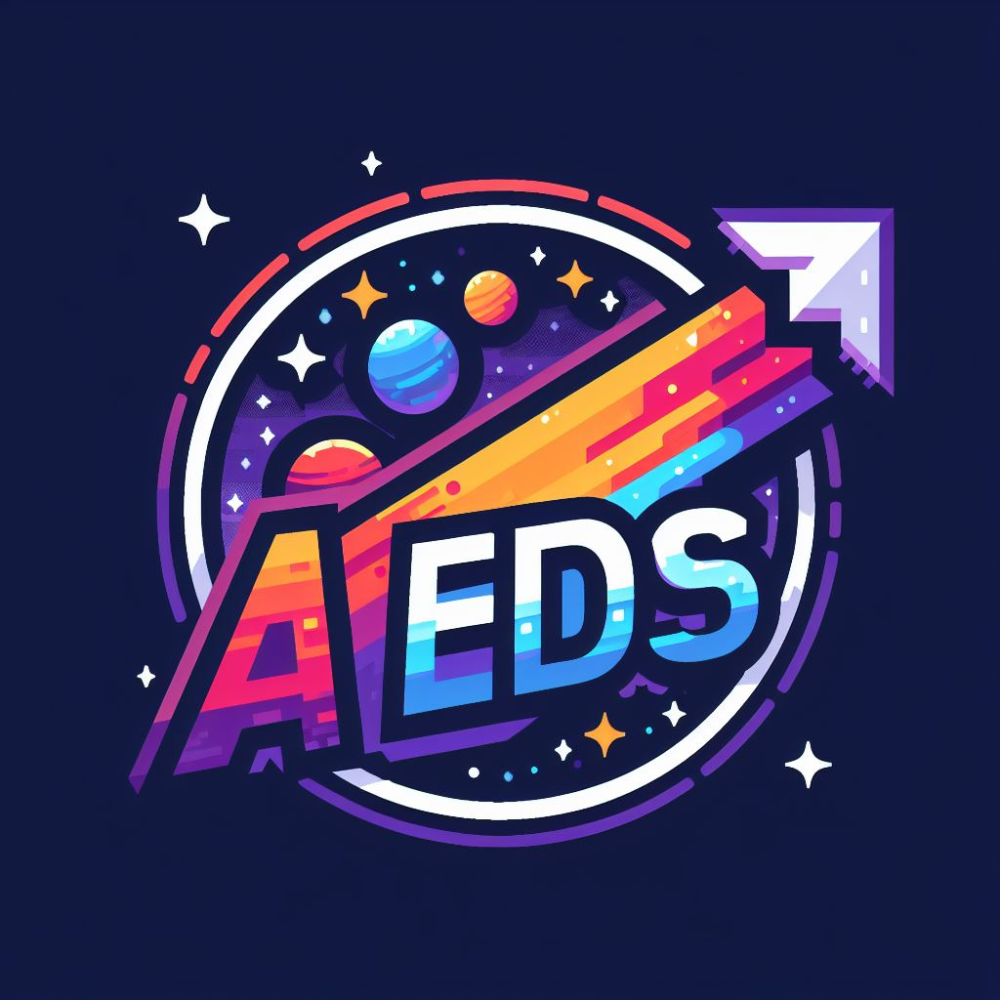

    

#   👾 Algoritmos e Estruturas de Dados (AEDS)

## ☕ Introdução

Este repositório contém todos os meus trabalhos para a disciplina de Algoritmos e Estruturas de Dados, do CEFET - MG Campus V. Cada trabalho está em sua própria pasta, com seu próprio README detalhando o que foi feito.

## 🎯 Objetivos

O objetivo deste repositório é documentar meu progresso e aprendizado na disciplina de Algoritmos e Estruturas de Dados.

## 📂 Estrutura do Repositório

Cada pasta neste repositório representa um trabalho diferente. Aqui está uma visão geral do que você encontrará:

- `Trabalho 1 - Jogo da Vida`: Este trabalho implementa o Jogo da Vida de Conway, um autômato celular, como um exercício de manipulação de matrizes. O algoritmo gera N gerações a partir de uma matriz inicial.
- `Trabalho 2 - Análise de Eficiência de Algoritmos`: Este trabalho analisa a eficiência de algoritmos que buscam o maior e o menor valor em um vetor. O objetivo é entender como a eficiência do algoritmo pode impactar o desempenho da busca.

## 🚀 Como executar os projetos

1. Clone este repositório
2. Navegue até a pasta do trabalho que deseja executar
3. Siga as instruções no README da pasta

## 📚 Recursos utilizados

## 📝 Licença

Este projeto está sob a licença MIT License. Veja o arquivo [LICENSE](LICENSE) para mais detalhes.

Feito com 💜 por Matheus

